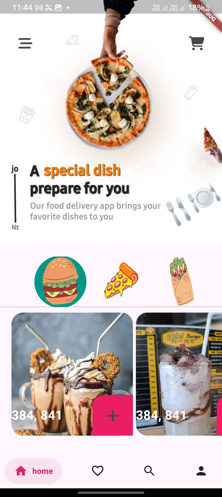
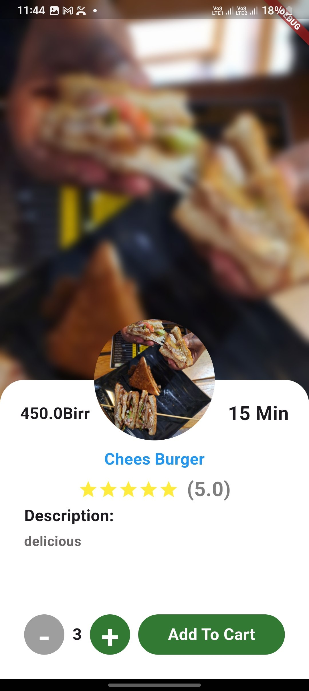
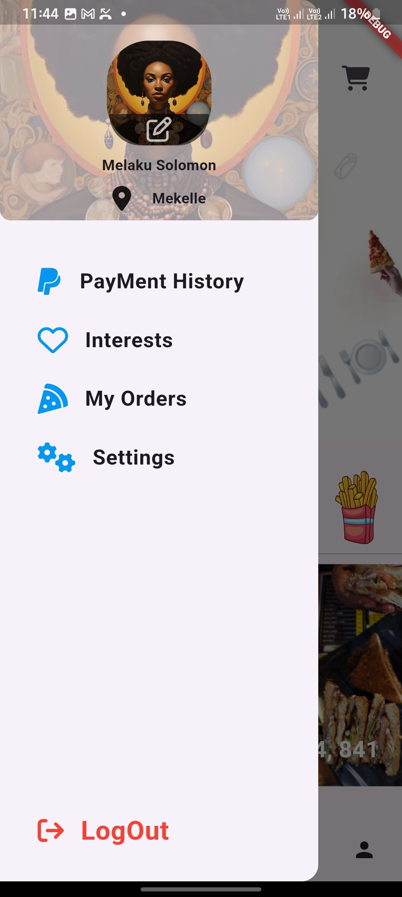

# deliver


## Getting Starte

# 🍔 Flutter Food Delivery UI

A sleek and modern **Flutter Food Delivery UI** project — designed to showcase beautiful layouts, reusable components, and smooth interactions for a food delivery mobile app.

---

## 🚀 Features

- 🏠 Home page with categories & featured items
- 🍽️ Product detail view with description and add-to-cart
- 🛒 Shopping cart interface
- 🔍 Search functionality
- 👤 Profile page


---

## 📱 Screenshots

| Home Page | Product Detail | Cart Page |
|-----------|----------------|-----------|
|  |  |  |

---

## 🛠️ Tech Stack

- **Flutter** (Dart)
- **Bloc** (State Management) 
- **Google Fonts**
- **Responsive Design**

---

## 🔧 Getting Started

### Prerequisites

- Flutter SDK:
- Android Studio / VS Code

### Installation

```bash
git clone https://github.com/your-username/flutter-food-delivery-ui.git
cd flutter-food-delivery-ui
flutter pub get
flutter run
